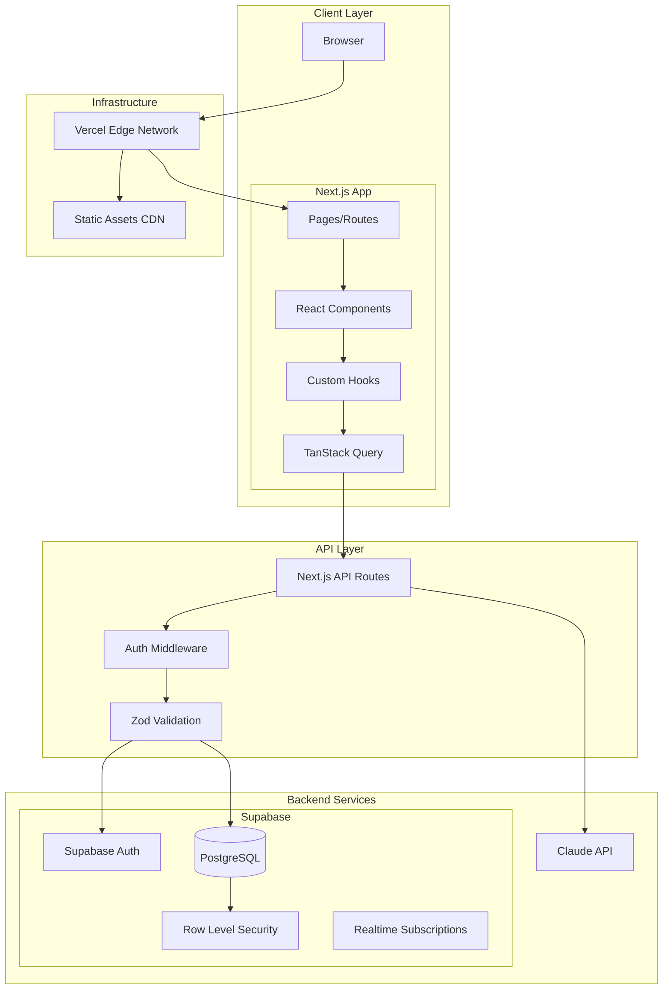
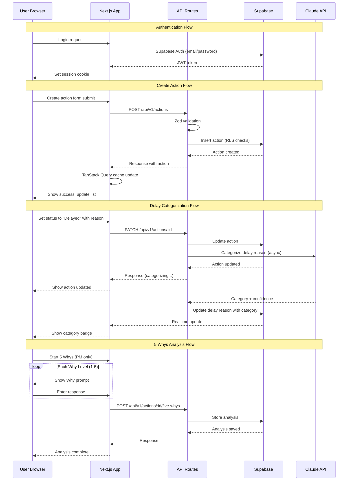
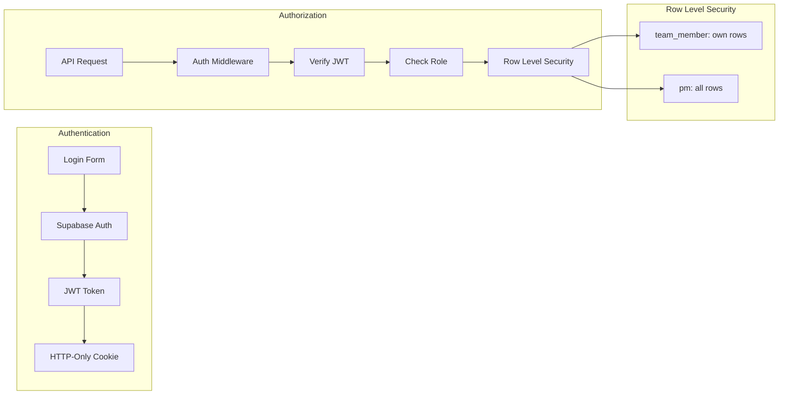

# Architecture Document: MiseKai

**Version**: 1.0
**Date**: February 1, 2026
**Status**: Approved

---

## Overview & Design Principles

MiseKai is built with a **pragmatic simplicity** philosophy: optimize for developer productivity and time-to-market while maintaining a clear migration path for future scaling needs.

### Core Design Principles

1. **Speed-to-Value**: Prioritize batteries-included solutions that minimize configuration and boilerplate
2. **Portability**: Choose technologies with clear migration paths (PostgreSQL over proprietary databases)
3. **Type Safety**: End-to-end TypeScript for compile-time error catching
4. **Security by Default**: Row Level Security at the database layer, not just application layer
5. **Progressive Enhancement**: Start simple, add complexity only when needed

### Constraints Driving Decisions

| Constraint | Impact on Architecture |
|------------|----------------------|
| 1 PM + Claude development team | Favor DX and productivity over raw performance |
| 2-week MVP timeline | Choose batteries-included solutions |
| 6-10 concurrent users | No need for enterprise scale initially |
| PostgreSQL requirement | RLS for row-level security |
| Future AWS migration possible | Document portability for each choice |

---

## Technology Stack Summary

| Category | Chosen | Rationale |
|----------|--------|-----------|
| Frontend Framework | Next.js 14 | Full-stack, excellent DX, Vercel-optimized |
| Backend/Database | Supabase | Auth + DB + RLS in one, PostgreSQL portable |
| Hosting | Vercel | Zero-config deploys, edge network, native Next.js |
| Styling | Tailwind CSS | Utility-first, no CSS-in-JS runtime |
| Validation | Zod | TypeScript-first, runtime + compile-time safety |
| Data Fetching | TanStack Query | Caching, optimistic updates, devtools |
| UI Components | shadcn/ui | Copy-paste ownership, Radix primitives |
| AI Integration | Claude API | Best reasoning, structured outputs |

---

## System Architecture



---

## Detailed Technology Decisions

### 1. Frontend Framework

#### Comparison Matrix

| Feature | Next.js 14 | Remix | SvelteKit |
|---------|------------|-------|-----------|
| React Ecosystem | Native | Native | Different paradigm |
| Server Components | Yes (App Router) | Partial | No |
| Deployment Simplicity | 10/10 (Vercel) | 8/10 | 7/10 |
| Learning Curve | Medium | Medium | Low-Medium |
| TypeScript Support | Excellent | Excellent | Excellent |
| AI/Claude Familiarity | High | Medium | Low |
| Community Size | Very Large | Growing | Medium |
| Bundle Size | Medium | Small | Small |

#### Next.js 14 (Chosen)

**Pros**:
- Server Components reduce client bundle size and improve initial load
- App Router provides intuitive file-based routing with layouts
- Vercel deployment is literally zero-config
- Largest ecosystem of examples, tutorials, and packages
- Claude has extensive training data on Next.js patterns
- Built-in API routes eliminate separate backend service
- Image optimization, fonts, and SEO built-in

**Cons**:
- App Router still maturing (some edge cases)
- Can feel "magical" with complex caching behavior
- Vercel-optimized means other hosts may have friction
- Server Components require mental model shift

#### Remix (Alternative 1)

**Pros**:
- Excellent data loading patterns with loaders/actions
- Progressive enhancement by default
- Better handling of nested routes and errors
- More explicit about what runs where
- Smaller bundle sizes typically

**Cons**:
- Smaller ecosystem than Next.js
- Less AI training data available
- Deployment requires more configuration
- Server components not as mature

#### SvelteKit (Alternative 2)

**Pros**:
- Smallest bundle sizes, best runtime performance
- Simpler syntax, less boilerplate
- Growing rapidly with excellent DX
- Good TypeScript support

**Cons**:
- Different paradigm from React - steeper initial learning for React devs
- Smaller component ecosystem
- Fewer AI assistant training examples
- Would require learning new framework

**Justification**: Next.js 14 provides the fastest path to MVP with App Router's full-stack capabilities, excellent Claude/AI familiarity for accelerated development, and zero-friction Vercel deployment. The React ecosystem ensures access to any component or utility library needed.

**Lock-in Assessment**:
| Aspect | Portability |
|--------|-------------|
| React components | 100% portable to any React framework |
| API routes | Easy migration to Express/Fastify |
| App Router conventions | Next.js specific, but logic is portable |
| Migration path | Can incrementally adopt other frameworks |

---

### 2. Backend Platform

#### Comparison Matrix

| Feature | Supabase | Firebase | PlanetScale + Auth0 |
|---------|----------|----------|---------------------|
| Database | PostgreSQL | Firestore (NoSQL) | MySQL (Vitess) |
| Auth Built-in | Yes | Yes | Separate (Auth0) |
| Row Level Security | Native PostgreSQL | Security Rules | Application layer |
| SQL Support | Full SQL | No (document queries) | Full SQL |
| Pricing (small scale) | Free tier generous | Free tier generous | 2 services to pay |
| Self-host Option | Yes (Docker) | No | Yes (both) |
| Real-time | Yes | Yes | No built-in |
| Local Development | supabase start | Emulators | Local MySQL |

#### Supabase (Chosen)

**Pros**:
- PostgreSQL underneath = database is 100% portable
- RLS policies are native PostgreSQL (no vendor lock-in)
- Auth, database, storage, and real-time in one service
- Generous free tier (500MB database, 50K monthly users)
- `supabase start` provides local Docker environment
- Can self-host with Docker if needed
- Generated TypeScript types from database schema
- SQL migrations are portable

**Cons**:
- Auth is the primary lock-in point (Supabase-specific client)
- Edge functions less mature than AWS Lambda
- Smaller ecosystem than Firebase
- Company younger than Google (Firebase) - longevity question

#### Firebase (Alternative 1)

**Pros**:
- Google backing = long-term stability
- Excellent real-time capabilities
- Large ecosystem and community
- Great mobile SDK support
- Generous free tier

**Cons**:
- Firestore is NoSQL - data model less flexible
- Security rules are Firebase-specific (not portable)
- No SQL support - complex queries harder
- Vendor lock-in is significant
- Data export is cumbersome

#### PlanetScale + Auth0 (Alternative 2)

**Pros**:
- MySQL with Vitess = excellent scalability
- Auth0 is industry-leading auth provider
- Both services are best-in-class for their domain
- Good for high-scale applications

**Cons**:
- Two services to configure and maintain
- Higher cost at any scale (two paid tiers)
- No built-in real-time
- More integration work required
- PlanetScale deprecated free tier

**Justification**: Supabase provides the best combination of developer experience, PostgreSQL portability, and integrated features for a small team. The database layer has zero lock-in (standard PostgreSQL), and while auth requires migration effort if switching, this is a reasonable tradeoff for the integrated development experience.

**Lock-in Assessment** (per ADR-001):

| Component | Portability | Migration Path |
|-----------|-------------|----------------|
| PostgreSQL DB | 100% portable | Direct export to RDS |
| SQL Migrations | 100% portable | Standard SQL |
| RLS Policies | 100% portable | Native PostgreSQL |
| Supabase Auth | Requires migration | AWS Cognito or Auth0 |
| Supabase Client | Requires replacement | Prisma/Drizzle |

---

### 3. Hosting

#### Comparison Matrix

| Feature | Vercel | Netlify | AWS Amplify |
|---------|--------|---------|-------------|
| Next.js Optimization | Native (creator) | Good | Good |
| Deploy Complexity | Zero-config | Zero-config | Medium |
| Edge Functions | Yes | Yes | Yes |
| Preview Deployments | Automatic | Automatic | Automatic |
| Pricing (small) | Free tier sufficient | Free tier sufficient | Pay-per-use |
| Analytics | Built-in | Built-in | CloudWatch |
| Enterprise Features | Yes | Yes | Full AWS |
| Cold Start | Minimal | Minimal | Variable |

#### Vercel (Chosen)

**Pros**:
- Created Next.js - guaranteed optimal support
- Zero-configuration deployment (git push = deploy)
- Automatic preview deployments for every PR
- Global edge network with 100+ PoPs
- Built-in analytics and Web Vitals
- Generous free tier (100GB bandwidth, 100 deployments/day)
- Instant rollbacks
- Native integration with Next.js features (ISR, Edge Runtime)

**Cons**:
- Premium pricing at scale ($20+/seat for teams)
- Vendor lock-in for some features (Edge Config, KV)
- Bandwidth overage can be expensive
- Not suitable for long-running processes

#### Netlify (Alternative 1)

**Pros**:
- Excellent DX, similar to Vercel
- Good Next.js support (though not native)
- Split testing built-in
- Forms handling built-in
- Competitive pricing

**Cons**:
- Next.js support via adapter (not native)
- Some Next.js features may lag
- Less optimal for App Router features
- Edge functions slightly different API

#### AWS Amplify (Alternative 2)

**Pros**:
- Full AWS ecosystem access
- Pay-per-use can be cheaper at scale
- No deployment limits
- Enterprise compliance (HIPAA, SOC2)
- Easy path to other AWS services

**Cons**:
- More configuration required
- Less optimal Next.js support
- Cold starts can be longer
- AWS console complexity
- Debugging more difficult

**Justification**: Vercel is the obvious choice for Next.js applications. As the creator and maintainer of Next.js, Vercel provides the most seamless deployment experience with zero configuration. The free tier easily covers a 6-10 user application.

**Lock-in Assessment**:
| Aspect | Portability |
|--------|-------------|
| Next.js app | 100% portable |
| Environment variables | Standard, portable |
| Edge functions | Vercel-specific but logic is portable |
| Migration path | Docker container → any host |

---

### 4. Styling

#### Comparison Matrix

| Feature | Tailwind CSS | CSS Modules | styled-components |
|---------|-------------|-------------|-------------------|
| Runtime Cost | Zero | Zero | ~12KB + runtime |
| Learning Curve | Medium | Low | Medium |
| Bundle Size | Purged (small) | Small | Medium |
| Type Safety | Via plugins | None | Full |
| Design System | Via config | Manual | Theme provider |
| Server Components | Works | Works | Requires config |
| DX with AI | Excellent | Good | Good |

#### Tailwind CSS (Chosen)

**Pros**:
- Zero runtime JavaScript - critical for Server Components
- Utility classes are self-documenting
- Design system via tailwind.config.js
- Excellent AI/Claude familiarity - can generate markup
- Purges unused CSS = tiny production bundles
- Consistent spacing/color scales out of box
- Works perfectly with shadcn/ui

**Cons**:
- HTML can look "busy" with many classes
- Learning utility names takes time
- Custom designs may need many arbitrary values
- Debugging can require understanding of utilities

#### CSS Modules (Alternative 1)

**Pros**:
- Standard CSS - no learning curve
- Scoped by default
- Zero runtime overhead
- Works everywhere

**Cons**:
- No design system without additional tooling
- More files to manage
- Harder for AI to generate consistent code
- Manual responsive design

#### styled-components (Alternative 2)

**Pros**:
- Full TypeScript integration
- Dynamic styles based on props
- Theme provider for design system
- Component-colocated styles

**Cons**:
- Runtime cost (~12KB + SSR complexity)
- Requires configuration for Server Components
- Can cause style flashes (FOUC)
- More complex debugging

**Justification**: Tailwind CSS provides the best balance of productivity and performance for this project. Zero runtime cost is essential for Server Components, and Claude can generate Tailwind markup effectively, accelerating development. The shadcn/ui components are built on Tailwind, providing a consistent design system.

**Lock-in Assessment**:
| Aspect | Portability |
|--------|-------------|
| Utility classes | Tailwind-specific but concepts transfer |
| Configuration | Project-specific, easy to recreate |
| Migration path | Can coexist with any CSS solution |

---

### 5. Validation

#### Comparison Matrix

| Feature | Zod | Yup | io-ts |
|---------|-----|-----|-------|
| TypeScript Integration | Inferred types | @types package | Native (fp-ts) |
| Bundle Size | ~12KB | ~15KB | ~5KB (+ fp-ts) |
| Learning Curve | Low | Low | High |
| Error Messages | Excellent | Good | Technical |
| Schema Composition | Excellent | Good | Excellent |
| JSON Schema Export | Yes | No | Yes |
| Async Validation | Yes | Yes | Yes |

#### Zod (Chosen)

**Pros**:
- TypeScript types inferred from schemas (single source of truth)
- Excellent error messages out of box
- Small bundle size (~12KB)
- Works great with tRPC, React Hook Form, etc.
- Claude understands Zod schemas well
- Can generate JSON Schema for documentation
- Transforms and refinements are intuitive

**Cons**:
- Slightly larger than io-ts core
- Less functional programming purity than io-ts
- Some edge cases with recursive types

#### Yup (Alternative 1)

**Pros**:
- Popular with Formik
- Familiar API for many developers
- Good documentation
- Battle-tested

**Cons**:
- TypeScript types via @types (not inferred)
- No JSON Schema export
- Dual source of truth (schema + types)
- Less active development

#### io-ts (Alternative 2)

**Pros**:
- Smallest core bundle
- Type-safe by design
- Functional programming patterns
- Excellent for complex validations

**Cons**:
- Requires fp-ts (steep learning curve)
- Error messages need customization
- Less intuitive for imperative developers
- Smaller community

**Justification**: Zod provides TypeScript-first validation with inferred types, eliminating the dual-maintenance problem of separate types and validation schemas. Its excellent Claude familiarity accelerates development, and it integrates seamlessly with TanStack Query and React Hook Form.

**Lock-in Assessment**:
| Aspect | Portability |
|--------|-------------|
| Validation logic | Portable concepts |
| Schema definitions | Zod-specific syntax |
| Migration path | Schema logic easily rewritten |

---

### 6. Data Fetching

#### Comparison Matrix

| Feature | TanStack Query | SWR | RTK Query |
|---------|---------------|-----|-----------|
| Caching | Excellent | Excellent | Excellent |
| DevTools | Comprehensive | Basic | Redux DevTools |
| Optimistic Updates | Built-in | Manual | Built-in |
| Bundle Size | ~13KB | ~4KB | ~12KB + Redux |
| Learning Curve | Medium | Low | Medium-High |
| Mutations | First-class | Manual | First-class |
| Pagination | Built-in | Manual | Built-in |
| TypeScript | Excellent | Good | Excellent |

#### TanStack Query (Chosen)

**Pros**:
- Comprehensive caching with automatic background refetch
- Optimistic updates reduce perceived latency
- Excellent DevTools for debugging cache state
- First-class mutation support with rollback
- Pagination, infinite scroll, and prefetching built-in
- Works with any fetch function (not tied to REST/GraphQL)
- Large community and excellent documentation

**Cons**:
- Larger bundle than SWR (~13KB vs ~4KB)
- More concepts to learn (queries, mutations, cache keys)
- Can be overkill for simple apps

#### SWR (Alternative 1)

**Pros**:
- Smallest bundle size (~4KB)
- Simple API, easy to learn
- Created by Vercel (good Next.js integration)
- Stale-while-revalidate pattern built-in

**Cons**:
- Mutations are manual
- Less comprehensive caching control
- DevTools less powerful
- Optimistic updates require more code

#### RTK Query (Alternative 2)

**Pros**:
- Integrated with Redux (if already using)
- Excellent TypeScript support
- Code generation for APIs
- Comprehensive feature set

**Cons**:
- Requires Redux (~12KB + Redux)
- Overkill if not using Redux elsewhere
- More boilerplate
- Steeper learning curve

**Justification**: TanStack Query provides the best data synchronization primitives for a CRUD-heavy application like MiseKai. Its optimistic update patterns and automatic cache invalidation reduce code complexity while improving UX. The DevTools accelerate debugging significantly.

**Lock-in Assessment**:
| Aspect | Portability |
|--------|-------------|
| Query hooks | TanStack-specific API |
| Caching logic | Concepts transfer to any caching solution |
| Migration path | Fetch logic is plain functions, easily moved |

---

### 7. UI Components

#### Comparison Matrix

| Feature | shadcn/ui | Chakra UI | Material UI |
|---------|----------|-----------|-------------|
| Ownership Model | Copy-paste (you own) | Package dependency | Package dependency |
| Bundle Size | Only what you use | ~40KB | ~80KB+ |
| Customization | Full control | Theme + props | Theme + sx prop |
| Accessibility | Radix primitives | Built-in | Built-in |
| Design Language | Neutral | Neutral | Material Design |
| Tailwind Compatible | Native | No | With adapter |
| Learning Curve | Low | Medium | Medium |

#### shadcn/ui (Chosen)

**Pros**:
- Copy-paste components = you own the code
- Built on Radix primitives = excellent accessibility
- Tailwind CSS native = zero runtime overhead
- Install only components you need
- Full control to modify/extend
- Beautiful default design
- Excellent TypeScript support
- Claude can generate and modify components directly

**Cons**:
- Must maintain components yourself (no package updates)
- Less comprehensive than full UI libraries
- Some components require additional libraries (charts, etc.)

#### Chakra UI (Alternative 1)

**Pros**:
- Comprehensive component library
- Excellent accessibility
- Good theming system
- Active community

**Cons**:
- Package dependency (updates can break things)
- ~40KB bundle addition
- Not Tailwind native (different styling approach)
- Less control over implementation

#### Material UI (Alternative 2)

**Pros**:
- Most comprehensive React component library
- Material Design = familiar to users
- Excellent documentation
- Enterprise-ready

**Cons**:
- Large bundle size (~80KB+)
- Material Design may not fit all aesthetics
- Heavy abstraction layer
- Can feel opinionated

**Justification**: shadcn/ui provides the best balance of quality, accessibility, and ownership for a small team. By copying components into your codebase, you avoid dependency version conflicts and gain full control to customize. Built on Radix primitives ensures accessibility, and Tailwind CSS integration maintains zero runtime overhead.

**Lock-in Assessment**:
| Aspect | Portability |
|--------|-------------|
| Components | You own the code |
| Radix primitives | Portable React components |
| Migration path | Components are already yours |

---

### 8. AI Integration

#### Comparison Matrix

| Feature | Claude API | OpenAI GPT-4 | Local LLM |
|---------|------------|--------------|-----------|
| Reasoning Quality | Excellent | Excellent | Variable |
| Structured Output | Native (tool_use) | Function calling | Varies |
| Context Window | 200K tokens | 128K tokens | 4K-32K typically |
| Latency | Medium | Medium | Low (local) |
| Cost (per 1K tokens) | ~$0.003-0.015 | ~$0.003-0.03 | Free (compute cost) |
| Privacy | Cloud | Cloud | Full local |
| Reliability | High | High | Self-managed |

#### Claude API (Chosen)

**Pros**:
- Superior reasoning for root cause analysis (5 Whys)
- 200K context window handles full conversation history
- Native structured outputs with tool_use
- Excellent at following system prompts
- Consistent output quality
- Good rate limits for small applications

**Cons**:
- Cloud-dependent (latency, availability)
- Cost at scale (though minimal for this use case)
- Data leaves your infrastructure
- API changes possible

#### OpenAI GPT-4 (Alternative 1)

**Pros**:
- Industry standard, well-documented
- Good structured output via function calling
- Large ecosystem of tools
- Multiple model tiers (GPT-4, GPT-3.5)

**Cons**:
- Smaller context window (128K vs 200K)
- Slightly less consistent at following complex prompts
- Similar cloud/cost concerns
- Rate limits can be restrictive

#### Local LLM (Alternative 2)

**Pros**:
- Full data privacy
- No per-request cost
- No external dependency
- Works offline

**Cons**:
- Requires significant compute resources
- Quality varies significantly by model
- Setup and maintenance burden
- Smaller context windows typically

**Justification**: Claude API provides superior reasoning capabilities critical for the 5 Whys analysis and delay categorization features. The 200K context window ensures full conversation history can be included for better context, and native structured outputs simplify integration. For 6-10 users with occasional AI calls, cost is negligible.

**Lock-in Assessment**:
| Aspect | Portability |
|--------|-------------|
| Prompt engineering | Concepts transfer to any LLM |
| API integration | Thin wrapper, easy to swap |
| Migration path | OpenAI, Anthropic, or local - all use similar patterns |

---

## Data Flow Diagram



---

## Security Architecture

### Authentication & Authorization



### Security Measures

| Layer | Protection | Implementation |
|-------|------------|----------------|
| Transport | HTTPS/TLS | Vercel default |
| Authentication | JWT tokens | Supabase Auth |
| Authorization | Role-based | RLS policies |
| Data Access | Row-level | PostgreSQL RLS |
| Input Validation | Schema validation | Zod |
| SQL Injection | Parameterized queries | Supabase client |
| XSS | Escaping + CSP | React + headers |
| CSRF | SameSite cookies | Supabase default |
| Rate Limiting | Request throttling | API middleware |

### RLS Policy Example

```sql
-- Users can only see their own actions
CREATE POLICY "Users see own actions"
ON actions FOR SELECT
USING (owner_id = auth.uid());

-- PM can see all actions
CREATE POLICY "PM sees all actions"
ON actions FOR SELECT
USING (
  EXISTS (
    SELECT 1 FROM profiles
    WHERE id = auth.uid()
    AND role = 'pm'
  )
);
```

---

## Deployment Pipeline

```mermaid
graph LR
    subgraph "Development"
        Local[Local Dev] --> Commit[Git Commit]
        Commit --> Push[Push to GitHub]
    end

    subgraph "CI/CD (Vercel)"
        Push --> Build[Build]
        Build --> Lint[Lint + Type Check]
        Lint --> Test[Run Tests]
        Test --> Preview[Preview Deploy]
    end

    subgraph "Review"
        Preview --> PR[Pull Request]
        PR --> Review[Code Review]
    end

    subgraph "Production"
        Review --> Merge[Merge to main]
        Merge --> Prod[Production Deploy]
        Prod --> Monitor[Monitoring]
    end
```

### Environment Configuration

| Environment | Database | Purpose |
|-------------|----------|---------|
| Local | Supabase local (Docker) | Development |
| Preview | Supabase staging | PR previews |
| Production | Supabase production | Live users |

---

## Future Migration Considerations

### AWS Migration Path (if needed)

Should MiseKai need to migrate to AWS infrastructure, here's the path:

| Current | AWS Equivalent | Migration Effort |
|---------|---------------|------------------|
| Supabase DB | RDS PostgreSQL | Low (pg_dump/restore) |
| Supabase Auth | Cognito or Auth0 | Medium (user migration) |
| Vercel hosting | Amplify or ECS | Medium (container setup) |
| Edge Functions | Lambda@Edge | Low (function rewrite) |
| Supabase Realtime | AppSync or Pusher | Medium |

### Migration Checklist

- [ ] Export PostgreSQL database (pg_dump)
- [ ] Migrate RLS policies (they're standard SQL)
- [ ] Set up Cognito/Auth0 user pool
- [ ] Migrate user accounts with password reset flow
- [ ] Update client SDK from @supabase/supabase-js to AWS SDK
- [ ] Configure Amplify or ECS deployment
- [ ] Update environment variables
- [ ] Test all flows in staging

### Timeline Estimate

- Database migration: 1-2 days
- Auth migration: 1-2 weeks (due to user coordination)
- Hosting migration: 2-3 days
- Testing and validation: 1 week

---

## Appendix: Decision Record Format

Each technology decision follows this structure (aligned with ADR-001):

```
### [Technology Category]

**Status**: Accepted | Proposed | Deprecated

**Context**: Why a decision was needed

**Decision**: What was chosen (Option X)

**Rationale**: Why this option over alternatives

**Consequences**: Trade-offs accepted

**Lock-in Assessment**: Portability and migration path
```

---

*MiseKai Architecture: Pragmatic simplicity with clear migration paths.*
